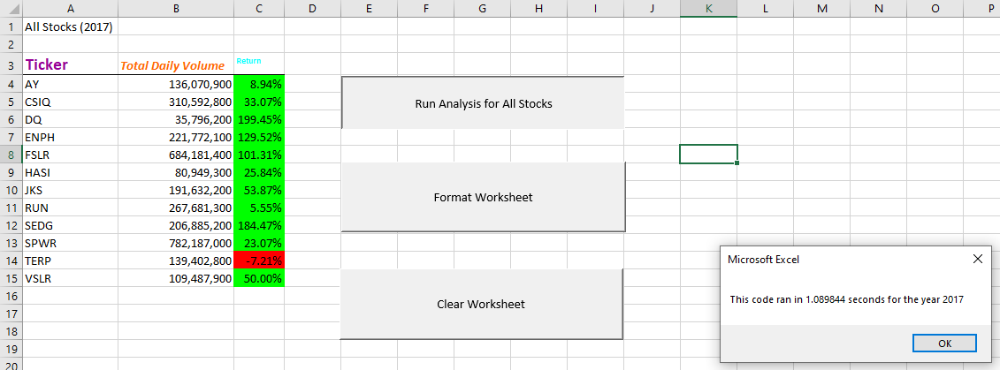

# Stock Analysis

## Overview of Project
Steve gave us some green stock information to analyze how 12 stocks volume & price changed in 2017 and 2018. Steve & his parents are specifically interested in the performance of Daqo (DQ) stock.

Using VBA on the green_stocks dataset we explored how to create macros, refactor code, and recorded the performance of our original code against our refactored code. 

## Results

## Summary