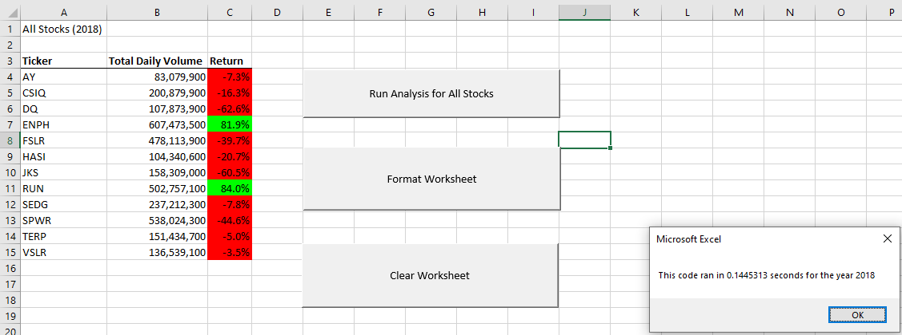

# Stock Analysis

## Overview of Project
Steve gave us some green stock information to analyze how 12 stocks volume & price changed in 2017 and 2018. Steve & his parents are specifically interested in the performance of Daqo (DQ) stock.

Using VBA on the green_stocks dataset we explored how to create macros, refactor code, and recorded the performance of our original code against our refactored code. 

## Results
# Stock Performance

- Our analysis of Daqo (DQ) in 2017 & 2018 shows the following:
  - 2017
    - DQ had a daily trading volume of ~36M shares and a great yearly return of 199.45% in 2017.
    - All of the 12 green stocks we analyzed in 2017 saw positive returns except for TERP stock.
  - 2018
    - DQ's daily trading volume more than tripled to ~108M shares, but lost 62.60% in 2018. 
    - DQ was not the only losing stock in 2018, of the 12 stocks we analyzed, only RUN & ENPH grew in 2018. 
# Code
The refactored code was a success, as seen above:
- It took our original code 1.089844 seconds to run our 2017 analysis for 12 stocks.
- It took our original code 1.054688 seconds for the year 2018.
Below you can see the results of our refactoring:

- Our refactored 2017 macro only took 0.1640625 seconds, which saved 0.9257815 seconds.
- Our refactored 2018 macro only took 0.1445313 seconds, which saved 0.9101567 seconds.

The main change that we made to the code that looped over the rows and arrays:
- We used a nested loop in the module & refactored the script to have three separate for loops.
  - Not counting the formatting for loops.

Original

Refactored

## Summary
# Advantages and Disadvantages of Refactoring Code in General
Depending on the time saved it may or may not be worth it to refactor code. If a significant amount of time is spent to save a barely noticeable amount of time, one should probably just leave the original code as is. 

However, there are many instances where refactoring code would absolutely be worthwhile, especially for larger datasets. Finding the right balance between time spent refactoring code and time saved by the increased efficiency is key.

# Advantages and Disadvantages of the Original and Refactored VBA Script
The original script did allow us some more formatting customization in terms of adjusting the styles and colors in the column titles.

We can clearly see the benefits of refactoring code here, we can save a lot of time by making our code more efficient. The benefit in this example might be small, but at a larger scale such as analyzing thousands of stocks we can reap the rewards. 

On the other hand, there are some things to look out for if scaling this code up, stock ticker information would have to manually be added to the ticker array, which allows for human error. Additionally, the use of three similiarly named arrays caused some issues when testing the refactored code. We might unintentionally spend extra time refactoring code due to mistakes as the code gets more complex for us, even if the computer runs it more efficiently.

